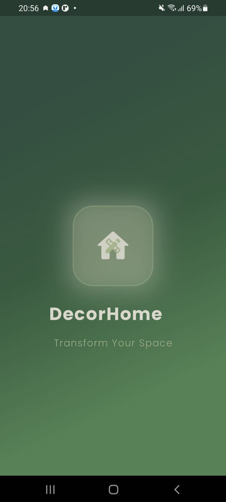
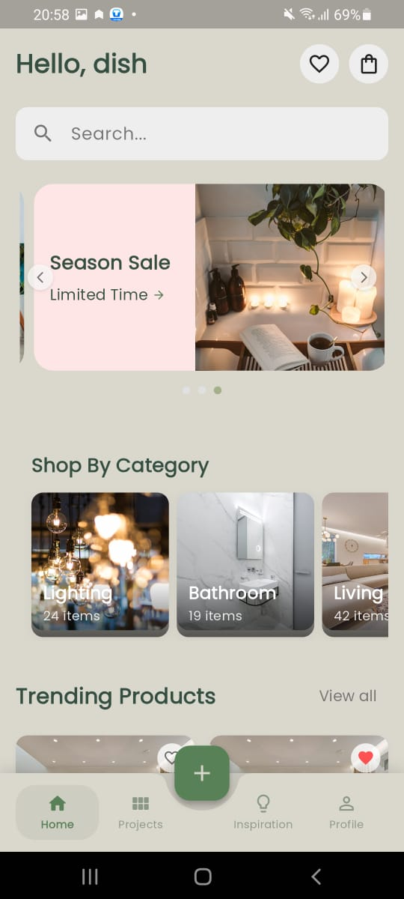
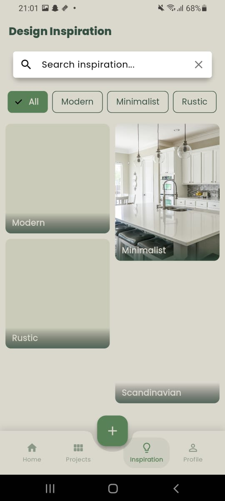
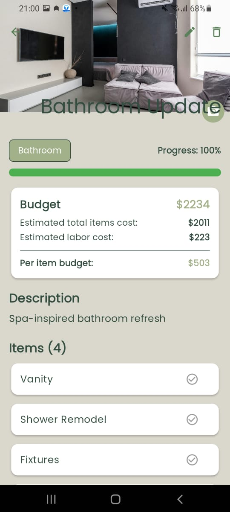
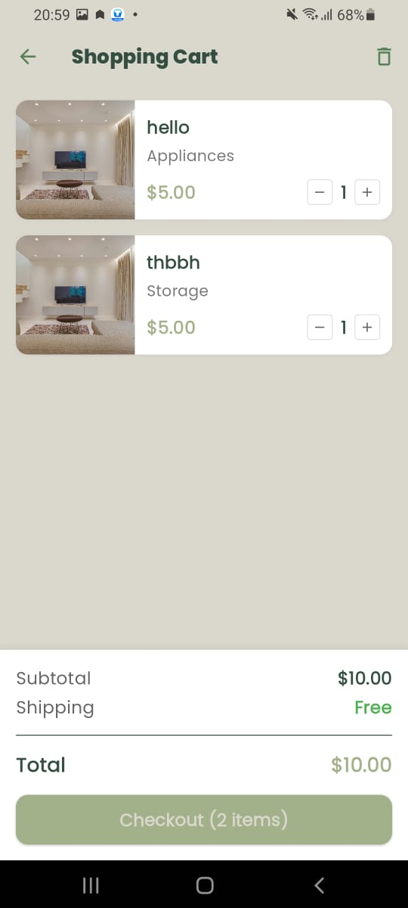
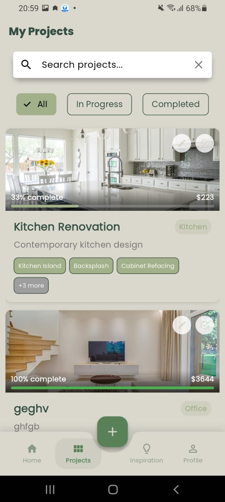
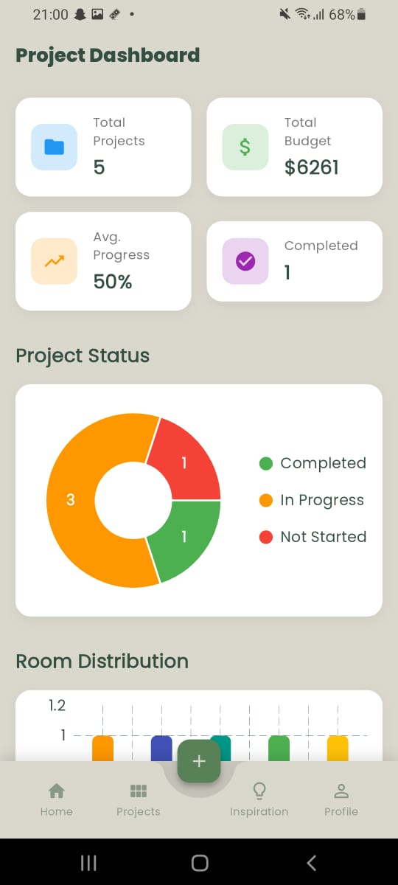
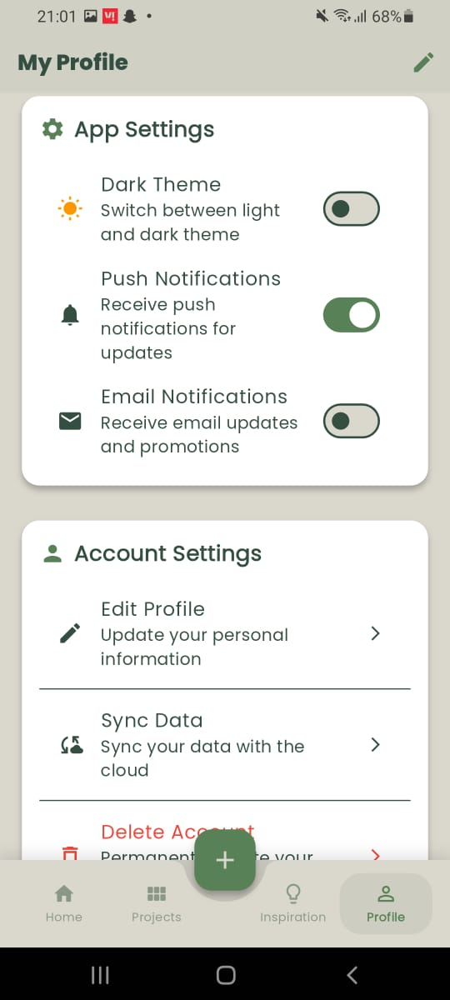

# DecorHome - Home Decoration App

<p align="center">
  
</p>

## 📱 About
DecorHome is a modern Flutter application for home decoration enthusiasts. It provides a platform for exploring, planning, and implementing interior design ideas, allowing users to visualize and organize their home decoration projects.

## ⬇️ Download & Try

<p align="center">
  <b>Direct APK Download</b><br>
  <a href="https://github.com/ishwargoswami/HomeDecor/releases/download/v1.0.0/decor_home_v1.0.0.apk">
    
  </a>
</p>

<p align="center">
  <b>Scan to Download</b><br>
  
  <br>
  <i>Scan this QR code with your phone camera to download</i>
</p>

### Installation Instructions

1. Download the APK file using the link above
2. Enable "Install from Unknown Sources" in your device settings
3. Open the downloaded APK file to install the app
4. Launch the app and enjoy!

## ✨ Features

- **User Authentication**: Secure login and signup with email and Google Sign-In
- **Explore Decoration Items**: Browse trending decoration items with detailed information
- **Project Management**: Create and manage home decoration projects
- **Wishlist**: Save favorite items for future reference
- **Shopping Cart**: Add items to cart and seamless checkout process
- **Recently Viewed**: Track browsing history for easy access to previously viewed items
- **Budget Planning**: Set and track budgets for decoration projects
- **Categories**: Browse items by categories (furniture, lighting, accessories, etc.)
- **User Profile**: Personalized experience with profile management
- **Orders History**: View past orders and their status

## 📸 Screenshots

<p align="center">
  
  
  
  
</p>

<p align="center">
  
  
  
  
</p>

## 🔧 Technologies Used

- **Flutter**: Cross-platform UI toolkit for building natively compiled applications
- **Firebase**: Backend services including authentication, Firestore, and storage
- **Provider**: State management solution
- **Google Sign-In**: OAuth authentication with Google
- **Cloud Firestore**: NoSQL database for storing user and product data
- **Firebase Storage**: Media storage for product images
- **Animations**: Custom animations for enhanced user experience

## ⚡ App Version History

### v1.0.0 (Current)
- Initial release with core features
- Home decoration browsing and project planning
- Shopping cart and checkout functionality
- User authentication and profile management

### Upcoming Features
- Interior design recommendations
- AR furniture preview
- Social sharing of projects
- Community decorating tips

## 💻 For Developers

If you're interested in building the app from source code:

### Prerequisites
- Flutter SDK (version 3.0.0 or higher)
- Dart SDK (version 2.16.0 or higher)
- Android Studio / VS Code with Flutter extensions
- Firebase account

### Building the App

1. Clone the repository:
```bash
git clone https://github.com/ishwargoswami/HomeDecor.git
cd HomeDecor
```

2. Install dependencies:
```bash
flutter pub get
```

3. Configure Firebase:
   - Create a new Firebase project
   - Add Android and iOS apps to your Firebase project
   - Download and place the Google Services configuration files
   - Enable Authentication methods (Email/Password and Google Sign-In)
   - Set up Firestore database with appropriate rules

4. Build the APK:
```bash
flutter build apk --release --no-tree-shake-icons
```

The APK will be generated at `build/app/outputs/flutter-apk/app-release.apk`

## 📧 Contact

For any inquiries, please reach out to: iishw.tech@gmail.com

---

<p align="center">Made with ❤️ by Ishwar</p>
